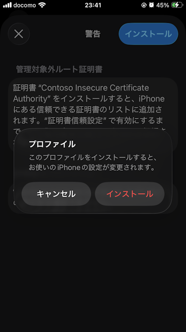

# IPA Over The Air

## Abstracts

* How to setup OTA (Over Tha Air) for IPA file

## Dependencies

* [nginx](https://github.com/nginx/nginx)
  * 1.26.1
  * BSD 2-Clause License
* [OpenSSL](https://github.com/PrismLibrary/Prism)
  * OpenSSL License/SSLeay License
    * Download 1.0.2u from https://indy.fulgan.com/SSL/
    * openssl.cnf is obtained from source code

## How to use?

#### 01. Create certificates

First, you need to create certificates.
You can use these scripts

* [Misc/10_GenerateCertificateIPAddress](../../../Misc/10_GenerateCertificateIPAddress)

Then, copy all generated files (ca.crt, ca.key, server.crt, server.csr and server.key) into [WebServer/nginx/03_IPAOverTheAir](WebServer/nginx/03_IPAOverTheAir).

You can not change ip address after create certificate.

#### 03. Generate IPA files

1. Select **Custom**


2. Select **Release Testing**


3. Check **Include manifest for over-the-air installation** and select **Next**


4. Input **Name**, **App URL**, **Display imaeg URL** and  **Full Size imaeg URL** and select **Next**
IP Address SHALL be same value as created certififacate.


5. Choise **Automatically manage signing** or **Manually manage signing** and select **Next**


6. Choise **Automatically manage signing** or **Manually manage signing** and select **Next**


7. (Case if you choised Manually manage signing) Select proper certificate and app, then select **Next**


8. Select **Export**


After this, you will see ***.ipa** file and **manifest.plist**.

#### 03. Deploy nginx

Download and deploy nginx.
This script download nginx and deploy it.

````json
$ pwsh ConfigureNginx.ps1
````

#### 04. Deploy IPA files

Copy ***.ipa** file and **manifest.plist** into [WebServer/nginx/03_IPAOverTheAir/nginx/html](WebServer/nginx/03_IPAOverTheAir/nginx/html).

#### 05. Start nginx

````bash
$ pwsh Run.ps1
````

#### 06. Install Root CA file

1. Tap **1. Install self-signed certificate**


2. Select device (Thid dialog may be not present)


<br>


3. Open **Setting -> General -> VPN & Device Management** and select downloaded profile


4. Tap **Install**


5. Tap **Install**


6. Input passcode


7. Tap **Install**



8. Tap check button


9. Open **Setting -> General -> About -> Certificate Trust Settings** and select installed profile


10. Tap **Continue**


11. Installed profile is enabled


12. Tap **2. Install iOS app via OTA** and select **Install**


If tap **2. Install iOS app via OTA** in http page, you will see

