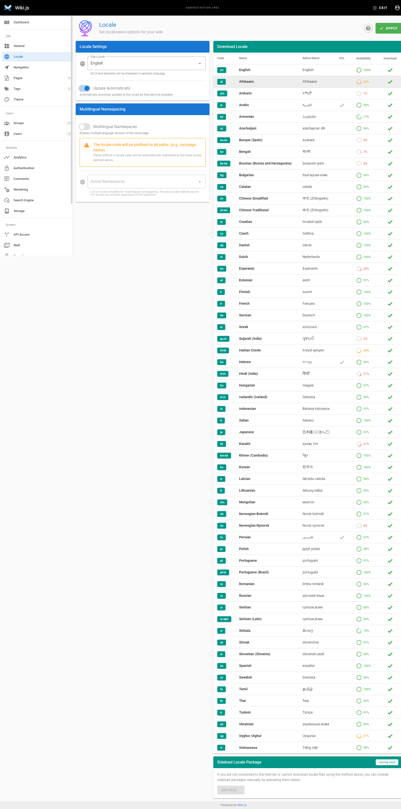

# Start Wiki.js on offline mode

## Abstracts

* Start Wiki.js by docker-compose
* Install language files manually when offline environmental

## Dependencies

* [docker-ce](https://github.com/docker/docker-ce)
  * Apache-2.0 license
* [docker-ce-cli](https://github.com/docker/cli)
  * Apache-2.0 license
* [containerd.io](https://github.com/containerd/containerd)
  * Apache-2.0 license
* [Wiki.js](https://github.com/Requarks/wiki)
  * GNU Affero General Public License

## How to use?

````sh
$ cd docker/sqlite
$ mkdir data
$ chmod 777 data
$ git clone https://github.com/Requarks/wiki-localization sideload
$ docker compose up -d
````

The following messages are from `docker logs -f wikijs`.
You can find that locate files are installed and offline mode is enabled.

````sh
2023-03-09T08:43:59.943Z [MASTER] info: =======================================
2023-03-09T08:43:59.946Z [MASTER] info: = Wiki.js 2.5.297 =====================
2023-03-09T08:43:59.946Z [MASTER] info: =======================================
2023-03-09T08:43:59.946Z [MASTER] info: Initializing...
2023-03-09T08:44:00.769Z [MASTER] info: Using database driver sqlite3 for sqlite [ OK ]
2023-03-09T08:44:00.774Z [MASTER] info: Connecting to database...
2023-03-09T08:44:00.785Z [MASTER] info: Database Connection Successful [ OK ]
2023-03-09T08:44:00.888Z [MASTER] warn: DB Configuration is empty or incomplete. Switching to Setup mode...
2023-03-09T08:44:00.888Z [MASTER] info: Starting setup wizard...
2023-03-09T08:44:01.079Z [MASTER] info: Starting HTTP server on port 3000...
2023-03-09T08:44:01.079Z [MASTER] info: HTTP Server on port: [ 3000 ]
2023-03-09T08:44:01.084Z [MASTER] info: HTTP Server: [ RUNNING ]
2023-03-09T08:44:01.084Z [MASTER] info: 🔻🔻🔻🔻🔻🔻🔻🔻🔻🔻🔻🔻🔻🔻🔻🔻🔻🔻🔻🔻🔻🔻🔻🔻🔻🔻🔻🔻🔻
2023-03-09T08:44:01.084Z [MASTER] info: 
2023-03-09T08:44:01.084Z [MASTER] info: Browse to http://YOUR-SERVER-IP:3000/ to complete setup!
2023-03-09T08:44:01.084Z [MASTER] info: 
2023-03-09T08:44:01.085Z [MASTER] info: 🔺🔺🔺🔺🔺🔺🔺🔺🔺🔺🔺🔺🔺🔺🔺🔺🔺🔺🔺🔺🔺🔺🔺🔺🔺🔺🔺🔺🔺
2023-03-09T08:44:24.726Z [MASTER] info: Creating data directories...
2023-03-09T08:44:24.728Z [MASTER] info: Generating certificates...
2023-03-09T08:44:24.770Z [MASTER] info: Persisting config to DB...
2023-03-09T08:44:24.933Z [MASTER] info: Installing default locale...

...

2023-03-09T08:44:26.708Z [MASTER] info: Sideload directory detected. Looking for packages...
2023-03-09T08:44:26.710Z [MASTER] info: Found locales master file. Importing locale packages...
2023-03-09T08:44:26.714Z [MASTER] info: Importing Afrikaans locale package...
2023-03-09T08:44:26.758Z [MASTER] info: Importing Amharic locale package...

...

2023-03-09T08:44:27.713Z [MASTER] info: Importing Thai locale package...
2023-03-09T08:44:27.725Z [MASTER] info: Importing Turkish locale package...
2023-03-09T08:44:27.758Z [MASTER] info: Importing Ukrainian locale package...
2023-03-09T08:44:27.776Z [MASTER] info: Importing Uyghur, Uighur locale package...
2023-03-09T08:44:27.786Z [MASTER] info: Importing Vietnamese locale package...
2023-03-09T08:44:27.809Z [MASTER] info: Imported 59 locale packages: [COMPLETED]

...

2023-03-09T08:44:30.843Z [MASTER] info: Purging orphaned upload files...
2023-03-09T08:44:30.843Z [MASTER] warn: Skipping job syncGraphLocales because offline mode is enabled. [SKIPPED]
2023-03-09T08:44:30.844Z [MASTER] warn: Skipping job syncGraphUpdates because offline mode is enabled. [SKIPPED]
2023-03-09T08:44:30.858Z [MASTER] info: Purging orphaned upload files: [ COMPLETED ]
Loading configuration from /wiki/config.yml... OK
2023-03-09T08:44:31.111Z [JOB] info: Rebuilding page tree...
2023-03-09T08:44:31.826Z [JOB] info: Using database driver sqlite3 for sqlite [ OK ]
2023-03-09T08:44:31.870Z [JOB] info: Rebuilding page tree: [ COMPLETED ]
````

## Locale

After running containers, you can access Wiki.js http://host-ip:3000.

