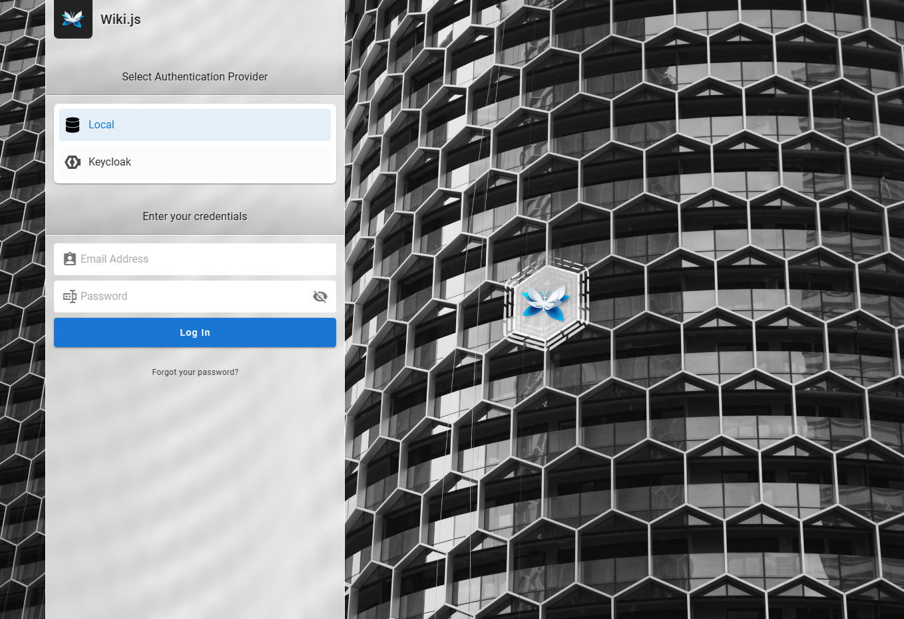
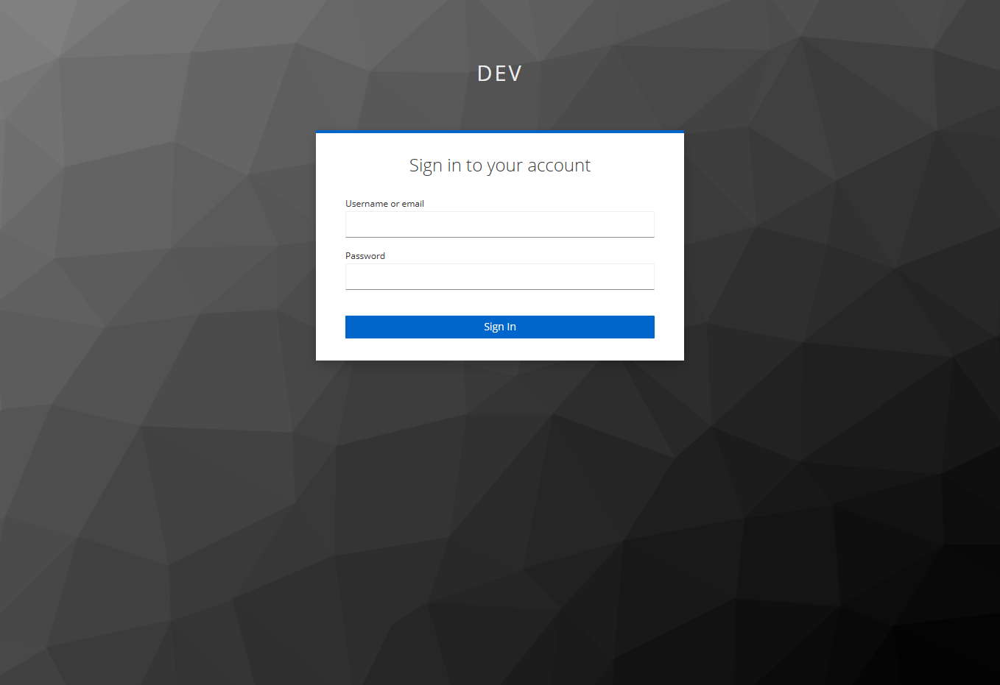
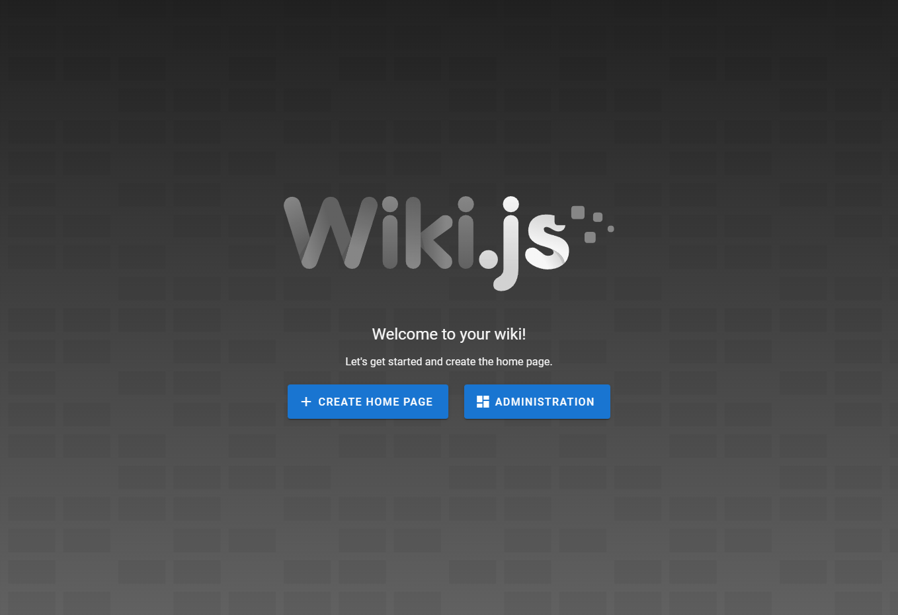

# Configuring Keycloak as a authentication provider in Wiki.jS

## Abstracts

* Start Wiki.js and Keycloak by docker-compose
* Configure Keycloak to use as a authentication provider

## Dependencies

* [docker-ce](https://github.com/docker/docker-ce)
  * Apache-2.0 license
* [docker-ce-cli](https://github.com/docker/cli)
  * Apache-2.0 license
* [containerd.io](https://github.com/containerd/containerd)
  * Apache-2.0 license
* [Keycloak](https://github.com/keycloak/keycloak)
  * 18.0.2
  * Apache-2.0 license
* [Wiki.js](https://github.com/Requarks/wiki)
  * GNU Affero General Public License

## How to use?

````sh
$ cd docker/sqlite
$ mkdir -p wiki.js/data
$ mkdir -p keycloak/data
$ chmod -R 777 wiki.js
$ chmod -R 777 keycloak
$ docker compose up -d
````

## How to setup?

### 1. Wiki.js

1. Go to Administration
1. Open `General`
1. Check `Site URL`
   * Set `http://<wiki.js ip>:<wiki.js port>`
   * If this value is `https://wiki.yourdomain.com`, redirect from Keycloak does not work
1. Open `Authentication`
1. Add `Keycloak` by clicking `ADD STRATEGY`
1. Copy `Callback URL / Redirect URI`
   * Copy `login/25c155b5-17dd-4b74-87bc-908f85ee69a6/callback` if test is `https://wiki.yourdomain.com/login/25c155b5-17dd-4b74-87bc-908f85ee69a6/callback`
1. Apply

### 2. Keycloak

1. Log into Keycloak as `admin`
   * password is written in `docker-compose.yaml`
1. Create Realm. For example, `dev`
1. Create Clients in created Relam

|Property|Value|
|---|---|
|Client ID|`wikijs`|
|Client Protocol|`openid-connect`|
|Root URL|`http://<wiki.js ip>:<wiki.js port>`|

3. Set values and Save

|Property|Value|
|---|---|
|Client ID|`wikijs`|
|Name Description Enabled|`ON`|
|Always Display in Console|`OFF`|
|Consent Required|`OFF`|
|Login Theme||
|Client Protocol|`openid-connect`|
|Access Type|`confidential`|
|Standard Flow Enabled|`ON`|
|Implicit Flow Enabled|`OFF`|
|Direct Access Grants Enabled|`ON`|
|OAuth 2.0 Device Authorization Grant Enabled|`OFF`|
|Front Channel Logout|`OFF`|
|Root URL|`http://<wiki.js ip>:<wiki.js port>`|
|Valid Redirect URIs|* `login/xxxxxxx-xxxx-xxxx-xxxx-xxxxxxxxxxxx/callback` (from Wiki.js)<br>* `*`|
Base URL||
|Admin URL|`http://<wiki.js ip>:<wiki.js port>`|
Logo URL||
Policy URL||
Terms of service URL||
|Web Origins|`+`|
Backchannel Logout URL||
|Backchannel Logout Session Required|`ON`|
|Backchannel Logout Revoke Offline Sessions|`OFF`|

4. Moev to `Credentials` tab and copy `Secret` value

### 3. Wiki.js

1. Go to Administration
1. Open `Authentication` and `Keycloak`
1. Set values and Save

|Property|Value|
|---|---|
|Display Name|`Keycloak`|
|Active|`ON`|
|Host|`http://<Keycloak ip>:<keycloak port>`|
|Realm|`dev`|
|Client ID|`wikijs`|
|Application Client Secret​|`<Secret value of Keycloak's client>`|
|Authorization Endpoint URL|`http://<Keycloak ip>:<keycloak port>/realms/<realm>/protocol/openid-connect/auth​`|
|Token Endpoint URL|`http://<Keycloak ip>:<keycloak port>/realms/<realm>/protocol/openid-connect/token​`|
|User Info Endpoint URL|`http://<Keycloak ip>:<keycloak port>/realms/<realm>/protocol/openid-connect/userinfo`​|
|Logout from Keycloak on Logout|`OFF`|
|Logout Endpoint URL|`http://<Keycloak ip>:<keycloak port>/realms/<realm>/protocol/openid-connect/logout`|

1. Set values and Save

|Property|Value|
|---|---|
|Allow self-registrations||
|Limit to specific email domains||
|Assign to group||

## Try



Access to Wiki.js and select `Keycloak`



Input proper credential values are regestrated in Keycloak



Redirect to Wiki.js if login was succeeded