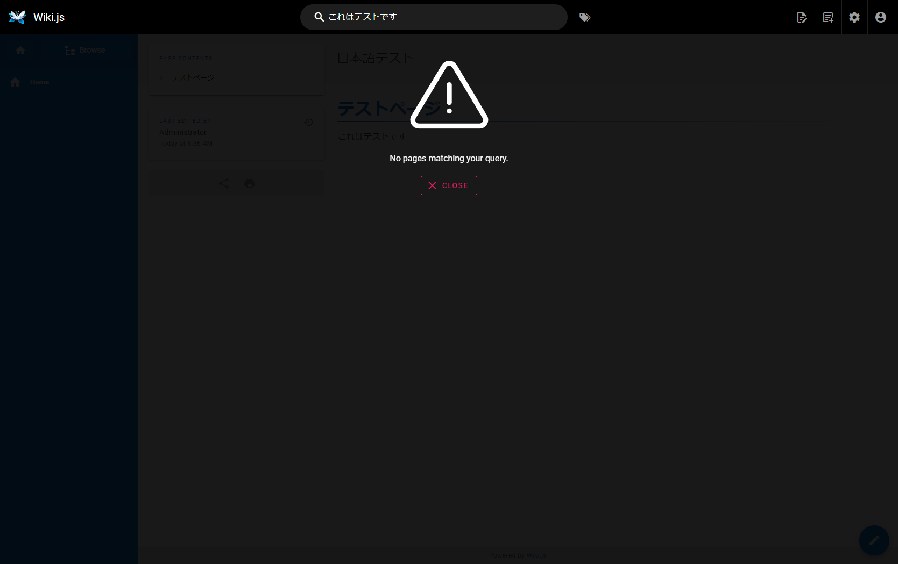
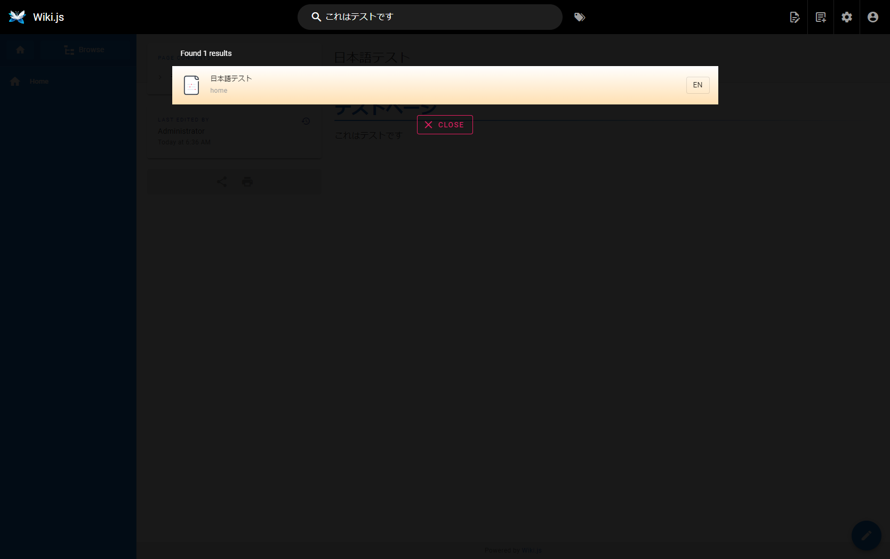

# Wiki.js use Elasticsearch

## Abstracts

* Default search function of Wiki.js is not good. Especially, Japanase is not supported
  * Elasticsearch allow us to search full text in wiki.js 

## Dependencies

* [docker-ce](https://github.com/docker/docker-ce)
  * Apache-2.0 license
* [docker-ce-cli](https://github.com/docker/cli)
  * Apache-2.0 license
* [containerd.io](https://github.com/containerd/containerd)
  * Apache-2.0 license
* [Elasticsearch](https://github.com/elastic/elasticsearch)
  * 7.17.9
  * Side Public License v1
  * Elastic License 2.0
  * Apache-2.0 compatible license
* [Wiki.js](https://github.com/Requarks/wiki)
  * GNU Affero General Public License

## How to use?

````sh
$ cd docker/sqlite
$ mkdir -p wiki.js/data
$ mkdir -p elasticsearch/data
$ chmod -R 777 wiki.js
$ chmod -R 777 elasticsearch
$ docker compose up -d
````

## How to setup?

### 1. Wiki.js

1. Go to Administration
1. Open `Sarch Engine`
1. Select `Elasticsearch`
1. Set values and Apply

|Property|Value|
|---|---|
|Elasticsearch Version|`7.x`|
|Host(s)||
|Verify TLS Cetificate|`OFF`|
|TLS Certificate Path|http://<elasticsearch ip>:<elasticsearch port>|
|Index Name|`wiki`|
|Analyzer|`simple`|
|Sniff on start|`OFF`|
|Sniff Interval|`0`|

## Try

Search `これはテストです` in content rather than title.

### Basic



### Elasticsearch

