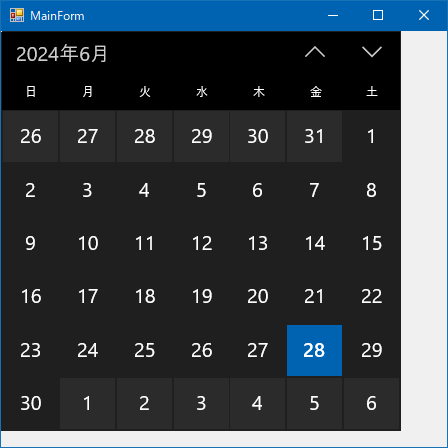

# Xaml Islands

## Abstracts

* Use UWP control in .NET Framework application
  * This application could work on .NET 5.0 but .NET 6.0 does not support `Windows.UI.Xaml` namespace. Please refer [https://learn.microsoft.com/en-us/windows/apps/desktop/modernize/desktop-to-uwp-enhance#winrt-apis-not-supported-in-net-6-or-later](https://learn.microsoft.com/en-us/windows/apps/desktop/modernize/desktop-to-uwp-enhance#winrt-apis-not-supported-in-net-6-or-later).

## Requirements

* .NET 4.8
* Windows 10 SDK 10.0.18362.0
 * `C:\Program Files (x86)\Windows Kits\10\UnionMetadata\Windows.winmd` may be missing so we should use specified version sdk.
* Visual Studio 2022 (if use)

## Dependencies

* [Microsoft.Toolkit.Forms.UI.XamlHost](https://www.nuget.org/packages/Microsoft.Toolkit.Forms.UI.XamlHost)
  * 5.1.1
  * MIT License

## Screenshots

