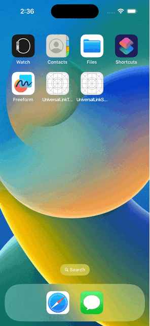

# Launch App by using Universal Link

## Requirements

### OSX

* Xcode 14.3
* Apple Developer Account with Apple Develop Program

## How to use?

### 1. Edit xcodeproj

Modify Team and Bundle Identifier 

### 2. Edit apple-app-site-association

Replace `appIDs` with modified Team and Bundle Identifier

### 3. UniversalLinkTarget/UniversalLinkTarget.entitlements

Modify `com.apple.developer.associated-domains`.
This domain shall be your domain.

### 4. Deploy apple-app-site-association

Deploy `apple-app-site-association` to `.well-known/apple-app-site-association` on your web server with your domain.
This domain shall support https.

### 5. Validate apple-app-site-association

You can use the following validator to check whether apple-app-site-association file is deployed correctly.

* https://branch.io/resources/aasa-validator/
* https://yurl.chayev.com/

### 6. Check Apple CDN

You can check whether `apple-app-site-association` is cached by Apple CDN.
For example,

````shell
curl -v https://app-site-association.cdn-apple.com/a/v1/taktak.jp

*   Trying [2001:1900:2389:1f::1fc]:443...
* Connected to app-site-association.cdn-apple.com (2001:1900:2389:1f::1fc) port 443 (#0)
* ALPN: offers h2
* ALPN: offers http/1.1
*  CAfile: /etc/ssl/cert.pem
*  CApath: none
* (304) (OUT), TLS handshake, Client hello (1):
* (304) (IN), TLS handshake, Server hello (2):
* (304) (IN), TLS handshake, Unknown (8):
* (304) (IN), TLS handshake, Certificate (11):
* (304) (IN), TLS handshake, CERT verify (15):
* (304) (IN), TLS handshake, Finished (20):
* (304) (OUT), TLS handshake, Finished (20):
* SSL connection using TLSv1.3 / AEAD-AES256-GCM-SHA384
* ALPN: server accepted http/1.1
* Server certificate:
*  subject: CN=app-site-association.cdn-apple.com; O=Apple Inc.; ST=California; C=US
*  start date: Aug 31 17:34:05 2022 GMT
*  expire date: Sep 30 17:34:04 2023 GMT
*  subjectAltName: host "app-site-association.cdn-apple.com" matched cert's "app-site-association.cdn-apple.com"
*  issuer: CN=Apple Public Server RSA CA 12 - G1; O=Apple Inc.; ST=California; C=US
*  SSL certificate verify ok.
> GET /a/v1/taktak.jp HTTP/1.1
> Host: app-site-association.cdn-apple.com
> User-Agent: curl/7.86.0
> Accept: */*
> 
* Mark bundle as not supporting multiuse
< HTTP/1.1 200 OK
< Date: Fri, 02 Jun 2023 16:52:22 GMT
< Content-Type: application/json
< Content-Length: 1203
< Connection: keep-alive
< Apple-From: https://taktak.jp/.well-known/apple-app-site-association
< Apple-Origin-Format: json
< Cache-Control: public, max-age=3600
< X-Cache: MISS
< CDNUUID: 90db5ad6-95bd-4779-a1b0-e549cc00a1cc-1323606289
< CDN-Server: lumn
< Age: 28
< Accept-Ranges: bytes
< 
{
   "applinks": {
      "details": [
         {
            "appIDs": [
               "U27JXXX492.takuyatakeuchi.demo.universallinktarget"
            ],
            "components": [
               {
                  "#": "no_universal_links",
                  "exclude": true,
                  "comment": "Matches any URL with a fragment that equals no_universal_links and instructs the system not to open it as a universal link."
               },
               {
                  "/": "/help/website/*",
                  "exclude": true,
                  "comment": "Matches any URL with a path that starts with /help/website/ and instructs the system not to open it as a universal link."
               },
               {
                  "/": "/help/*",
                  "?": { "articleNumber": "????" },
                  "comment": "Matches any URL with a path that starts with /help/ and that has a query item with name 'articleNumber' and a value of exactly four characters."
               },
               {
                  "/": "/buy/*",
                  "comment": "Matches any URL with a path that starts with /buy/."
               }
            ]
         }
      ]
   }
* Connection #0 to host app-site-association.cdn-apple.com left intact
}% 
````

### 7. Deploy apps

Build and deploy UniversalLinkTarget and UniversalLinkSource into device or simulator.

### 8. Launch UniversalLinkSource

You can launch UniversalLinkTarget from UniversalLinkSource.

